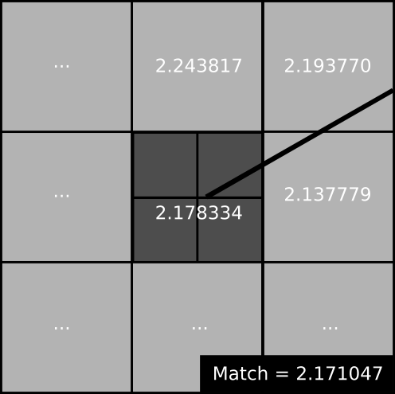
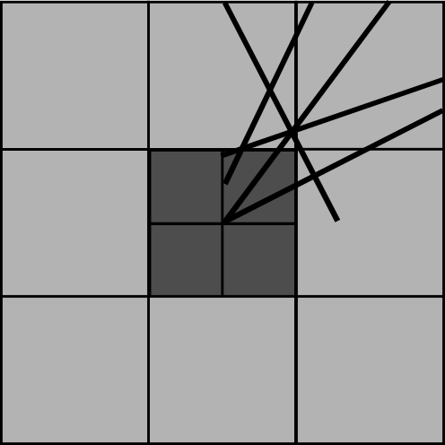
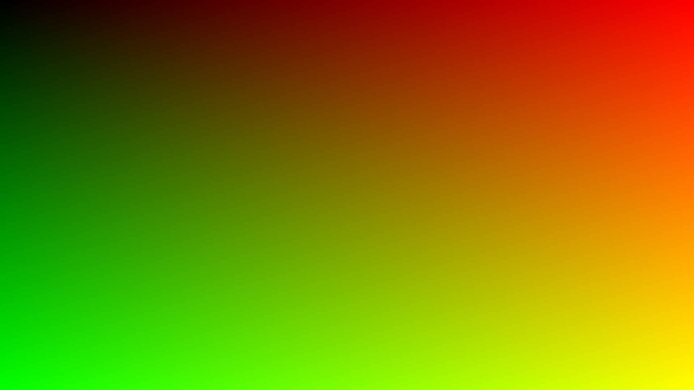
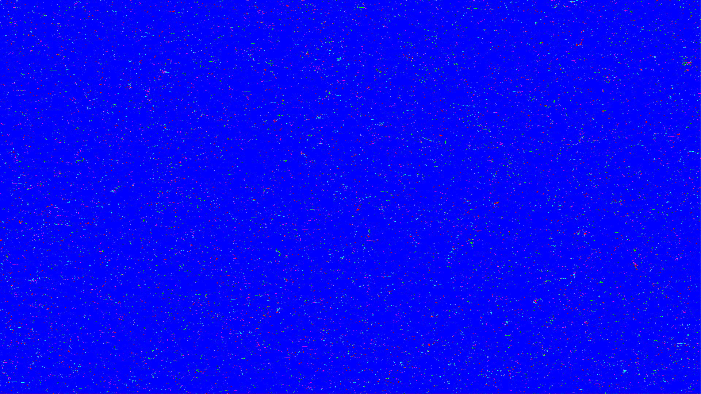

% Motifs léopards et sous-pixel : de code binaire à vecteur de nombres réels
% Reconstruction active à lumière non-structurée sous-pixellique
% Nicolas Hurtubise ~ DIRO

# Objectif du projet

## Combiner deux techniques de reconstruction active pour arriver à un nouvelle méthode de scan 3D qui est à la fois :

* Robuste au bruit, aux discontinuités et aux illuminations indirectes
* Précise au sous-pixel
* Simple et efficace

## Continuité de mon projet *Honor* de cet été avec Sébastien Roy

* Premier prototype en `Scheme`
* Match simplifié, pas d'heuristiques, non sous-pixellique

# Techniques existantes

| **Léopard**                           | **Phase-shift**                       |
|---------------------------------------+---------------------------------------|
| Lumière non-structurée                | Lumière structurée                    |
| Très Robuste                          | Relativement robuste                  |
| Sous-pixel difficile à obtenir        | Sous-pixel automatique                |
| Match sur un code binaire             | Phase = position (à $2k\pi$ près)     |

{width=31%}
{width=37%}
{width=31%}

{width=31%}
{width=37%}
{ width=31% }

# Léopard = Somme de sinus

{ width=25% }
{ width=25% }
{ width=25% }
{ width=25% }

{ width=40% }

# Léopard = Somme de sinus

## Somme de sinus $\rightarrow$ possibilité de déphaser le motif

Déphasages de $\frac{k}{3}2\pi$ :

$\newline$

{width=25%}
{width=25%}
{width=25%}
{width=25%}

# Idée : léopard + phase shift

* Déphaser graduellement chacun des sinus de l'image
* Récupérer la phase en chaque point
* Utiliser un vecteur de phases allant de $[-\pi, \pi[$ pour encoder les pixels (plutôt que 0 ou 1)
* [>Animation de la phase<](http://316k.legtux.org/presentation-imgs/dephasage.gif)

{width=30%}

# Récupération des phases

{width=50%}
{width=50%}

N vecteurs de taille k $\leftrightarrow$ M vecteurs de taille k

Besoin de trouver les correspondances entre les deux ensembles

# Établir la correspondance entre les pixels

## Solution : LSH

* Locality-sensitive hashing
* Idée : hacher les pixels du côté de la caméra et du côté de la référence et espérer tomber sur des bonnes correspondances.
* $P(Hash(p1) \approx Hash(p2)) \alpha \frac{1}{distance(p1, p2)}$
* Algo de Monte Carlo
* $O(nb\_iterations\times(N + M)) \rightarrow$ converge rapidement

# Établir la correspondance entre les pixels

## Problème

* Fonctionne bien pour des codes binaires
* Besoin d'adapter pour des codes de valeurs continues et circulaires sur $[-\pi, \pi[$

## Solution

1. Choix de $p$ phases aléatoires
2. Recalage de chaque phase sur $[0, b[$ (entier)
3. Clé de hachage = Concaténation des chiffres obtenus (en base $b$)

# Établir la correspondance entre les pixels

En ajustant les paramètres de l'algorithme, on obtient un excellent résultat sur des images comportant des déformations

{width=50%}
{width=50%}

# Établir la correspondance entre les pixels

## Impact du bruit sur la correspondance

Bruit additif sur l'image de caméra :

{width=50%}
{width=50%}

Note : le bruit est appliqué indépendament sur chaque pixel de chaque image de déphasage

# Établir la correspondance entre les pixels

Robustesse au bruit ajustable facilement selon les besoins

{width=50%}

# Établir la correspondance entre les pixels

Robustesse au bruit ajustable facilement selon les besoins

{width=50%}

# Accélérer la convergence

LSH peut *et va* faire des erreurs !

## Heuristiques

Forward matching & backward matching pour :

* Améliorer les matchs existants
* Créer de nouveaux matches

{width=60%}

# Match sur une déformation plus complexe

* Images bruitées
* Déformations diverses

{width=75%}

# Match sur une déformation plus complexe

* 20 patterns $\times$ 3 déphasages = 60 images à projeter
* $\approx$ 1m30 pour réaliser le match, 65 itérations de LSH, 13 passes d'heuristiques

{width=60%}

# Retrouver le sous-pixel

* Phase varie linéairement avec un décalage sous-pixellique
* Phase matchée se situe (probablement) entre le pixel matché et ses voisins

{width=40%}

# Retrouver le sous-pixel

* Chaque pattern projeté donne possiblement de l'information sur la position du sous-pixel
* $\rightarrow$ minimisation de la distance entre la phase du match et la position d'un sous-pixel pour tous les patterns

{width=40%}

# Résultats

{width=30%}

## Match sur un décalage de +0.15 pixels en X et +0.05 en Y

Positions en sous-pixel détectée après interpolation :

{width=50%}
{width=50%}

# Résultats

## Match sur un décalage de +0.15 pixels en X et +0.05 en Y

* Erreur visiblement petite
* Quadrants détectés par l'algo :

{width=50%}

# Conclusion

- Bons résultats sur des images synthétiques
- Beaucoup plus efficace que le prototype précédent :
    * Utilisation de C + OpenMP pour profiter du caractère trivialement parallélisable de l'algo
    * Amélioration de la convergence par des heuristiques
    * ~1m30s plutôt que 30min pour trouver des bonnes correspondances

# Conclusion

- Encore des améliorations possibles
    * Détection automatique du nombre d'itérations de LSH à effectuer
- À tester sur le terrain
    * Performances vs. d'autres algos de reconstruction active sous-pixellique
- Plus de tests & plus de rigueur $\rightarrow$ publication d'un article plutôt intéressant
